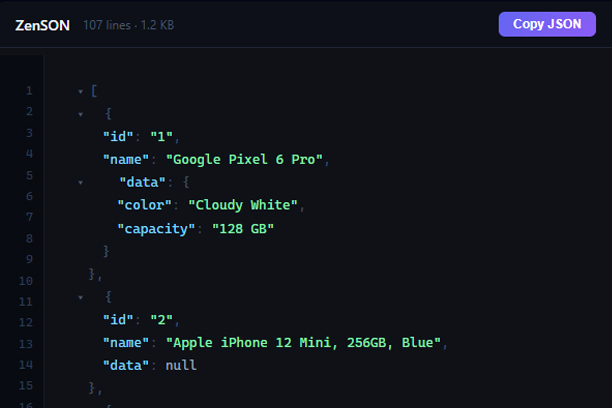

# JSON Prettifier

A lightweight, zero-dependency browser extension that instantly beautifies JSON — whether you paste it into the popup or land on a raw JSON page. Built with pure vanilla JavaScript, no build tools or npm packages required.


---

## Features

- **Syntax highlighting** — keys, strings, numbers, booleans, and nulls each get their own color
- **Collapsible nodes** — click the `▾` arrow next to any object or array to collapse it; a summary preview is shown inline while collapsed
- **Line numbers** — every line in the output panel has a row number in the gutter
- **Date detection & cycling** — ISO 8601 strings and Unix timestamps (seconds or milliseconds) are automatically detected and highlighted in gold. Click any date to cycle **all** dates in the document through 6 formats simultaneously:
  - `original` — exactly as it appeared in the JSON
  - `ISO 8601` — e.g. `"2024-01-15T08:30:00.000Z"`
  - `locale` — e.g. `"Jan 15, 2024, 8:30 AM"`
  - `relative` — e.g. `"3 months ago"`
  - `UTC` — e.g. `"Mon, 15 Jan 2024 08:30:00 GMT"`
  - `date only` — e.g. `"2024-01-15"`
- **Inline format comment** — a `// original` comment appears next to each date and updates as you cycle formats
- **Raw JSON page auto-detection** — when you navigate to a URL that returns raw JSON (e.g. an API endpoint), the page is automatically replaced with a prettified, highlighted, collapsible view
- **Minify** — collapse your JSON to a single line
- **Configurable indent** — choose 2 spaces, 4 spaces, or tabs
- **One-click copy** — copies the raw JSON string (not the highlighted HTML)
- **Auto-format on paste** — paste JSON into the input panel and it formats immediately

---

## Installation

### Chrome

1. Download the latest release zip and unzip it
2. Open Chrome and navigate to `chrome://extensions`
3. Enable **Developer Mode** using the toggle in the top-right corner
4. Click **Load unpacked** and select the unzipped `json-prettifier` folder
5. The extension icon will appear in your toolbar

### Opera

1. Download the latest release zip and unzip it
2. Open Opera and navigate to `opera://extensions`
3. Enable **Developer Mode**
4. Click **Load unpacked** and select the unzipped `json-prettifier` folder

### Edge

Edge supports Chrome extensions natively. Follow the same steps as Chrome, using `edge://extensions` instead.

---

## Usage

### Popup

Click the extension icon in your toolbar to open the popup.

- **Paste** JSON into the left panel — it formats automatically on paste
- Click **▶ Format** to manually format
- Click **⇢ Minify** to collapse to a single line
- Use the **Indent** dropdown to switch between 2 spaces, 4 spaces, or tabs
- Click **Copy** in the status bar to copy the raw JSON to your clipboard
- Click **✕ Clear** to reset both panels

### Raw JSON Pages

When you open a URL that serves raw JSON (e.g. a REST API endpoint, a `.json` file, or a local JSON server), the extension automatically detects and prettifies the page. A toolbar appears at the top with the line count, file size, and a Copy button.

You can also trigger this manually on any page by clicking the extension icon and pressing the **🌐 Page** button.

### Collapsing Nodes

Click the `▾` arrow to the left of any `{` or `[` to collapse that node. The arrow rotates to indicate the collapsed state and an inline summary is shown (e.g. `id, name, email` or `3 items`). Click the summary text or the arrow again to expand.

### Date Cycling

Any value recognised as a date — ISO 8601 strings like `"2024-01-15T08:30:00Z"` or Unix timestamps like `1706745600` — is highlighted in gold with a dashed underline and an `// original` comment beside it.

Click any date value to advance **all** dates in the document to the next format. The comment updates to show the active format label.

---

## Permissions

| Permission | Why it's needed |
|---|---|
| `activeTab` | Allows the extension to interact with the current tab when you click the 🌐 Page button |
| `scripting` | Allows the extension to inject the prettifier into raw JSON pages |

No data is collected, stored, or transmitted. The extension works entirely offline and makes no network requests of any kind.

---

## File Structure

```
json-prettifier/
├── manifest.json      # Extension manifest (Manifest V3)
├── popup.html         # Popup UI markup and styles
├── popup.js           # Popup logic (format, minify, copy, events)
├── renderer.js        # Shared recursive DOM tree renderer
├── content.js         # Content script for raw JSON page detection
└── icons/
    ├── icon16.png
    ├── icon48.png
    └── icon128.png
```

---

## Browser Compatibility

| Browser | Supported |
|---|---|
| Chrome 88+ | ✅ |
| Opera 74+ | ✅ |
| Edge 88+ | ✅ |
| Firefox | ❌ (uses different extension API) |

---

## License

MIT — do whatever you like with it.
